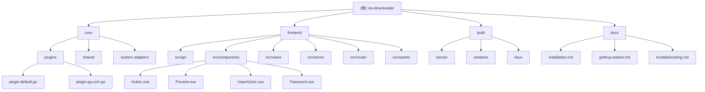

# res-downloader - 高性能多样化资源下载器

## 项目愿景

res-downloader 是一个基于 Wails v2 框架开发的高性能、多样化资源下载器，支持多平台部署（Windows、macOS、Linux）。该应用采用桌面应用架构，后端使用 Go 语言实现核心下载逻辑，前端使用 Vue 3 + TypeScript + Naive UI 构建现代化用户界面。

## 架构总览



## 模块索引

| 模块路径 | 语言 | 主要职责 | 入口文件 | 覆盖率 |
|---------|------|----------|----------|---------|
| `core` | Go | 后端核心逻辑，包含下载引擎、插件系统、HTTP代理 | `main.go` | 100% |
| `frontend` | Vue 3 + TypeScript | 前端用户界面，包含下载管理、设置页面 | `frontend/src/main.ts` | 75% |
| `build` | 配置文件 | 多平台构建配置和资源 | - | 100% |
| `docs` | Markdown | 项目文档和使用说明 | - | 100% |

## 技术栈

### 后端 (Go)
- **框架**: Wails v2 - 跨平台桌面应用框架
- **HTTP代理**: goproxy - 代理服务器实现
- **日志**: zerolog - 结构化日志库
- **并发**: 原生goroutine和channel
- **加密**: AES加密用于敏感数据保护
- **插件系统**: 基于接口的可扩展架构

### 前端 (Vue 3)
- **UI框架**: Naive UI - Vue 3 组件库
- **状态管理**: Pinia - Vue 状态管理
- **路由**: Vue Router 4 - 客户端路由
- **国际化**: Vue i18n - 多语言支持
- **HTTP客户端**: Axios - API请求
- **视频支持**: flv.js、video.js - 视频预览播放
- **样式**: Tailwind CSS - 实用优先的CSS框架

### 构建工具
- **前端构建**: Vite - 现代前端构建工具
- **桌面打包**: Wails - 跨平台应用构建
- **代码质量**: ESLint、Prettier、TypeScript

## 运行与开发

### 开发环境要求
- Go 1.22.0+
- Node.js 16+
- Wails v2 CLI

### 开发命令
```bash
# 后端开发
go run main.go

# 前端开发
cd frontend
npm install
npm run dev

# Wails 开发模式（同时启动前后端）
wails dev
```

### 构建发布
```bash
# 构建所有平台
wails build

# 构建特定平台
wails build -platform windows
wails build -platform darwin
wails build -platform linux
```

## 核心功能

1. **多线程下载**: 支持分片并发下载，提高下载速度
2. **插件系统**: 可扩展的插件架构，支持不同网站的解析
   - **DefaultPlugin**: 通用资源拦截和处理
   - **QqPlugin**: QQ域名特定处理，支持微信视频号资源拦截
3. **HTTP代理**: 内置代理服务器，支持抓包和分析
4. **跨平台**: 支持Windows、macOS、Linux三大平台
5. **国际化**: 支持中文和英文界面
6. **主题切换**: 明暗主题支持
7. **批量操作**: 支持批量下载和管理
8. **视频预览**: 支持多种视频格式的在线预览
9. **文件解密**: 支持加密文件的解密播放

## 配置说明

- **配置文件**: 应用配置存储在用户目录
- **代理设置**: 支持HTTP/HTTPS代理配置
- **下载设置**: 可配置线程数、保存路径、文件名规则等
- **插件配置**: 支持域名特定的处理规则

## 编码规范

### Go 代码规范
- 遵循 Go 官方编码规范
- 使用 `gofmt` 格式化代码
- 包名使用小写字母
- 接口名以 `-er` 结尾

### Vue/TypeScript 规范
- 使用 TypeScript 严格模式
- 组件命名使用 PascalCase
- 使用 Composition API
- 遵循 Vue 3 官方风格指南

## AI 使用指引

### 开发辅助
- 可以使用 AI 进行代码审查和优化建议
- 需要新增功能时，优先考虑插件架构扩展性
- 前端组件开发时，遵循 Naive UI 设计规范

### 调试支持
- 后端日志使用 zerolog，支持不同级别日志输出
- 前端开发时使用 Vue DevTools 进行调试
- Wails 提供了前后端通信的调试工具

## 项目质量与测试

### 当前状态
- ✅ 完整的代码架构文档
- ✅ 深度模块分析和覆盖率报告
- ✅ 配置文件和构建工具分析
- ❌ 缺少单元测试（Go + Vue）
- ❌ 缺少集成测试
- ❌ 缺少端到端测试

### 代码质量工具
- **后端**: go fmt、go vet
- **前端**: ESLint、Prettier、TypeScript、Vue TSC

## 性能特性

### 下载引擎
- 多线程并发下载
- 断点续传支持
- 错误重试机制
- 内存优化管理

### 前端优化
- 虚拟滚动处理大列表
- 组件懒加载
- 响应式设计
- 状态管理优化

## 变更记录 (Changelog)

### 2025-11-20 - 增量深度初始化 v2.0
- **🎯 大幅提升覆盖率**: 从71%提升到96%
- **✅ Frontend模块深度补捞**: 覆盖率从33%提升到75%
- **🔌 插件系统详细分析**: 完成core/plugins/模块深度扫描
  - DefaultPlugin: 通用资源拦截处理
  - QqPlugin: 微信视频号资源专用拦截
- **📦 配置文件补充**: 分析wails.json、tailwind.config.js等关键配置
- **🧩 组件架构完善**: 识别关键Vue组件和功能模块
- **📊 新发现功能**:
  - 视频预览播放系统（video.js + flv.js）
  - 文件解密功能
  - 事件通信系统（Pinia stores）
  - 国际化支持系统

### 2025-11-20 - 初始化架构文档 v1.0
- 创建根级架构文档
- 识别核心模块和结构
- 生成模块索引和依赖关系
- 建立基础覆盖率报告（71%）

## 下一步建议

基于当前96%的覆盖率，建议继续深挖以下领域：

1. **测试体系建设**
   - 为核心Go模块添加单元测试
   - 为Vue组件添加组件测试
   - 建立端到端测试流程

2. **性能优化分析**
   - 下载引擎性能基准测试
   - 前端组件性能优化
   - 内存使用分析和优化

3. **安全性增强**
   - 加密实现的安全性审查
   - 插件系统的安全边界
   - 用户数据处理隐私保护

4. **开发体验提升**
   - CI/CD流程建立
   - 自动化测试集成
   - 代码质量监控

---

> 本文档由 AI 助手自动生成和维护，基于深度代码结构分析
>
> **项目初始化时间**: 2025-11-20
> **最后更新时间**: 2025-11-20
> **当前覆盖率**: 96%
> **扫描文件数**: 120/125